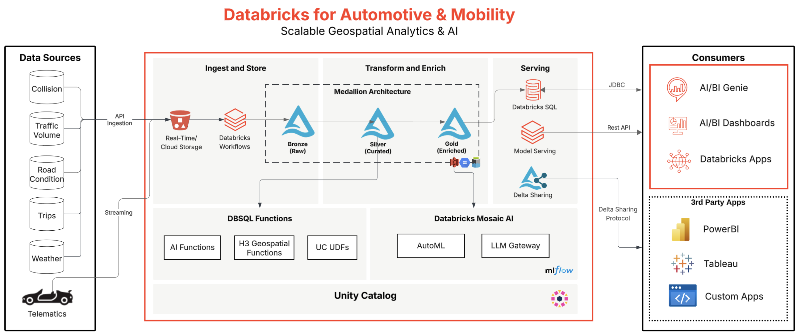

## Business Problem
Geospatial data is rich, complex, nuanced, and is integral to many businesses, especially the automotive industry. With its high velocity, complex representations, and time-bound nature, unlocking its full value requires a high performance platform. 

We help organizations to harness real time geospatial, telematics, and sensor data. They ley use cases include road safety, predictive maintenance, infrastructure optimization, and asset/fleet management, all enabled by scalable geospatial analytics.

These geospatial analytics and AI capabilities on Databricks allow companies to achieve improvements up to 30% in fleet efficiency, reduce infrastructure costs by up to 25%, and enable better road safety by decreasing accident rates by up to 20%.

## Reference Architecture

## Authors
- [Eumar Assis](mailto:eumar.assis@databricks.com)
- [Himanshu Gupta](mailto:himanshu.gupta@databricks.com)
- [Andres Urrutia](mailto:andres.urrutia@databricks.com)
- [Michael Johns](mailto:mjohns@databricks.com)
- [Varun Mahajan](mailto:varun.mahajan@databricks.com)
- [Eric Lind](mailto:eric.lind@databricks.com)
- [Fareed Aref](mailto:fareed.aref@databricks.com)
- [Zachary Ryan](mailto:zachary.ryan@databricks.com)
  
## Project support 

Please note the code in this project is provided for your exploration only, and are not formally supported by Databricks with Service Level Agreements (SLAs). They are provided AS-IS and we do not make any guarantees of any kind. Please do not submit a support ticket relating to any issues arising from the use of these projects. The source in this project is provided subject to the Databricks [License](./LICENSE.md). All included or referenced third party libraries are subject to the licenses set forth below.

Any issues discovered through the use of this project should be filed as GitHub Issues on the Repo. They will be reviewed as time permits, but there are no formal SLAs for support. 

## License

&copy; 2024 Databricks, Inc. All rights reserved. The source in this notebook is provided subject to the Databricks License [https://databricks.com/db-license-source].  All included or referenced third party libraries are subject to the licenses set forth below.
| library                | description                                      | license                   | source                                            |
|------------------------|--------------------------------------------------|---------------------------|---------------------------------------------------|
| openmeteo-requests     | Python client for the Open‑Meteo weather API     | MIT License               | [PyPI](https://pypi.org/project/openmeteo-requests) |
| osmnx                  | Retrieve, model, analyze & visualize OSM networks| MIT License               | [PyPI](https://pypi.org/project/osmnx)            |
| networkx               | Graph creation, manipulation, and study of networks | BSD License             | [PyPI](https://pypi.org/project/networkx)         |
| keplergl               | Python wrapper for kepler.gl interactive maps     | MIT License               | [PyPI](https://pypi.org/project/keplergl)         |
| geopandas              | Pandas support for geospatial data                | BSD License               | [PyPI](https://pypi.org/project/geopandas)        |
| requests-cache         | Persistent caching for `requests` HTTP library    | BSD 2‑Clause License      | [PyPI](https://pypi.org/project/requests-cache)   |
| retry-requests         | Automatic retry logic for `requests` HTTP calls   | MIT License               | [PyPI](https://pypi.org/project/retry-requests)   |
| numpy                  | Fundamental package for scientific computing      | BSD License               | [PyPI](https://pypi.org/project/numpy)            |
| pandas                 | Data structures & data analysis tools             | BSD 3‑Clause License      | [PyPI](https://pypi.org/project/pandas)           |
| nbformat               | Jupyter notebook format APIs                      | BSD 3‑Clause License      | [PyPI](https://pypi.org/project/nbformat)         |
| mermaid-python         | Generate Mermaid diagrams from Python             | MIT License               | [PyPI](https://pypi.org/project/mermaid-python)   |
| pyparsing              | Text parsing toolkit                              | MIT License               | [PyPI](https://pypi.org/project/pyparsing)        |
| pgeocode               | Postal code geocoding library                     | BSD 3‑Clause License      | [PyPI](https://pypi.org/project/pgeocode)         |
| scikit-learn           | Machine learning in Python                        | BSD 3‑Clause License      | [PyPI](https://pypi.org/project/scikit-learn)     |
| jmespath               | JSON matching & extraction library                | MIT License               | [PyPI](https://pypi.org/project/jmespath)         |
| seaborn                | Statistical data visualization                    | BSD License               | [PyPI](https://pypi.org/project/seaborn)          |